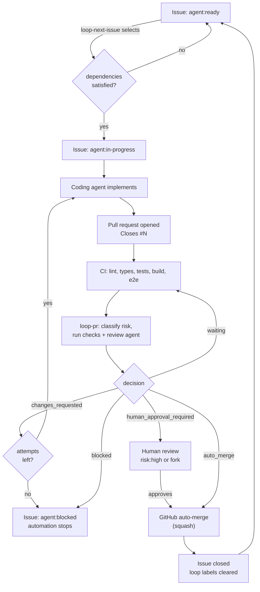

# Autonomous issue-to-merge loop

How a GitHub Issue becomes a merged pull request without a human in the middle —
and exactly where a human still is.

This extends [`issue-driven-development.md`](issue-driven-development.md), which
describes the same lifecycle when a person drives it. The rules in
[`AGENTS.md`](../AGENTS.md) apply unchanged; this document adds what happens
around them.

- [Lifecycle](#lifecycle)
- [Labels](#labels)
- [Issue dependencies](#issue-dependencies)
- [Risk classification](#risk-classification)
- [The review agent](#the-review-agent)
- [Merge gates](#merge-gates)
- [Retry policy and the fix loop](#retry-policy-and-the-fix-loop)
- [Stop conditions](#stop-conditions)
- [Observability](#observability)
- [Security model](#security-model)
- [Concurrency and its limits](#concurrency-and-its-limits)
- [Repository configuration](#repository-configuration)
- [Connecting a coding agent](#connecting-a-coding-agent)
- [What is not automated](#what-is-not-automated)

---

## Lifecycle



Every arrow out of `gate` is decided by
[`tooling/loop/src/merge-gate.ts`](../tooling/loop/src/merge-gate.ts), a pure
function covered by [`test/scenarios.test.ts`](../tooling/loop/test/scenarios.test.ts).

### The pieces

| Component | Where | What it does |
| --- | --- | --- |
| Policy | [`.github/loop-policy.json`](../.github/loop-policy.json) | Risk rules and the retry limit, as data |
| Dependencies | [`.github/loop-dependencies.json`](../.github/loop-dependencies.json) | Fallback dependency map for pre-existing issues |
| Decision logic | `tooling/loop/src/` | Pure functions: risk, checks, gate, selection |
| Pull request gate | `.github/workflows/loop-pr.yml` | Classify, review, publish gates, enable auto-merge |
| Next issue | `.github/workflows/loop-next-issue.yml` | Close out, select the next eligible issue |
| Agent dispatch | `.github/workflows/loop-agent-dispatch.yml` | The boundary to a coding agent runner |
| Bootstrap | `.github/workflows/loop-bootstrap.yml` | Create labels, print the manual settings |

The split is deliberate: the workflows gather facts from GitHub and act on
answers, while every *decision* is a pure function in `tooling/loop`. That is
what makes the merge policy testable without a network, and what keeps the
GitHub token out of the code that decides things.

---

## Labels

GitHub is the state store. There is no separate database.

| Label | Meaning | Who sets it |
| --- | --- | --- |
| `agent:ready` | A human has vetted this issue as suitable for the agent | Human |
| `agent:in-progress` | Claimed by the coding agent | `loop-agent-dispatch` |
| `agent:review` | A pull request is open and under automated review | `loop-pr` |
| `agent:blocked` | Automation stopped; a human is needed | `loop-pr`, `loop-agent-dispatch` |
| `risk:low` | Documentation and low-consequence changes | `loop-pr` (computed) |
| `risk:medium` | Application and shared library changes | `loop-pr` (computed) |
| `risk:high` | Security, infrastructure or architecture | `loop-pr` (computed), or a human to escalate |

`agent:ready` is the human vetting step, and it is the only thing standing
between an open issue and an agent working on it. An issue without it is never
picked up, however well specified it looks.

A `risk:` label on an **issue** participates in classification of the pull
request that closes it, and can only escalate — see below.

Lifecycle state lives on the issue; per-pull-request state (retry count, review
history) lives in a sticky comment on the pull request, in a fenced JSON block
after a `<!-- newsdeck-loop-state -->` marker.

---

## Issue dependencies

An issue declares what must ship before it can start, in its body:

```markdown
## Depends on

- #12
- #13
```

or on one line: `Depends on: #12, #13`. `Depends on: none` says explicitly that
nothing blocks it, which is worth writing — it distinguishes "checked" from
"nobody filled this in".

References are read **only** from inside that block. A `#12` mentioned anywhere
else in the body is prose, not a dependency; treating it as one would silently
stall issues. An issue is eligible only when every declared dependency is
**closed**. A dependency the loop cannot see — a wrong number, a deleted issue —
counts as unsatisfied, because unverifiable must never mean satisfied.

### The fallback map

[`.github/loop-dependencies.json`](../.github/loop-dependencies.json) carries
dependencies for the issues written **before** this convention existed.

An issue's own body always wins: a `Depends on` block — including `Depends on:
none` — retires that issue's entry in the map. The map is consulted only when a
body has no block at all.

It exists because rewriting those issue bodies through the available GitHub API
turned out to be lossy: it HTML-escapes quotes and strips autolinks. Damaging 27
issues to add a convenience block would be a poor trade. New issues carry the
section, because the Feature template does.

Like the policy, the map lives under `.github/`, so changing what may run next
always passes a human.

[`docs/roadmap.md`](roadmap.md) carries the same graph in human-readable form.

---

## Risk classification

Deterministic, and computed from three inputs only: the diff, the labels, and
the policy file. **No model output participates**, because this value decides
whether a change may merge without a human.

Risk is the **highest** of:

1. **The policy default** (`low`).
2. **Path rules.** Every changed path is matched against every rule in
   `.github/loop-policy.json`; the highest match wins. Matching upward rather
   than by specificity means a new file under a sensitive directory is protected
   by default, and a mistake in a pattern fails safe.
3. **Explicit `risk:` labels** on the pull request or its issue.
4. **Escalations** computed from the diff.

| Risk | Paths |
| --- | --- |
| `high` | `.github/**`, `tooling/loop/**`, `infra/**`, `docker-compose*.yml`, `packages/auth/**`, `apps/api/src/rpc/identity.ts`, `AGENTS.md`, `docs/architecture.md`, `docs/adr/**`, `docs/loop-engineering.md`, `.env.example`, `**/.env*` |
| `medium` | `apps/**`, `packages/**`, `e2e/**`, `scripts/**`, `tooling/**`, root toolchain config |
| `low` | `docs/**`, `README.md`, other Markdown |

Escalations to `high`, all mechanical:

- a **destructive migration** — `DROP TABLE`, `DROP SCHEMA`, `TRUNCATE`,
  `ALTER TABLE ... DROP COLUMN|CONSTRAINT` — added under `packages/db/drizzle/`
  (`DROP INDEX` does not count: it loses no data);
- a **breaking public API change** — an export removed from
  `packages/api-contract/src/` and not added back;
- a **major dependency upgrade** — the leading version number changes;
- **large-scale restructuring** — more than 40 files changed;
- **large-scale deletion** — more than 600 lines removed.

### Risk only moves up

An explicit `risk:` label can escalate a change but can **never** mark a
sensitive path as safe. Otherwise the cheapest way past the human gate would be
to add `risk:low` to a workflow change. This is asserted in
[`test/risk.test.ts`](../tooling/loop/test/risk.test.ts).

### Changing the policy

`.github/loop-policy.json` lives under `.github/`, which is itself classified
`high`. Changing the merge policy therefore always requires human approval —
including a change that would weaken it.

---

## The review agent

The review agent evaluates the pull request against the issue's Goal,
Acceptance Criteria and Out of Scope sections, the diff, the tests, `AGENTS.md`,
and the architecture constraints. It must answer with a single JSON object:

```json
{
  "status": "approve | request_changes | blocked",
  "findings": [
    {
      "severity": "info | low | medium | high | critical",
      "file": "apps/api/src/x.ts",
      "line": 12,
      "description": "what is wrong",
      "suggested_action": "what to do about it"
    }
  ],
  "summary": "one paragraph"
}
```

The output is **validated before use**
([`src/review.ts`](../tooling/loop/src/review.ts)). Anything that fails
validation — wrong shape, unknown status, prose instead of JSON, no output at
all — becomes `blocked`, never `approve`. An agent cannot approve a change by
emitting garbage, and a crashed review step does not read as "no objection".

### Deterministic checks run regardless

Six checks read the diff and produce findings in the same schema, whether or not
a review agent is configured:

| Check | Finds | Severity |
| --- | --- | --- |
| `check:secrets` | Credential-shaped strings in added lines | critical |
| `check:client-safety` | Server-only imports added to a client-safe package | high |
| `check:migrations` | Destructive SQL; a schema change with no migration | high |
| `check:dependencies` | New dependencies; major upgrades | medium / high |
| `check:debug-artifacts` | `debugger`, focused or skipped tests, `FIXME` | high / medium |
| `check:tests` | Source changed with no test changed | medium |

Deterministic findings can only make the outcome **stricter**. An agent that
approves cannot clear a secret this repository's own scanner found. Findings at
or above `high` block an automatic merge.

`check:secrets` never echoes the matched value into a finding: reporting a
leaked credential must not copy it into a public comment and a job log.

---

## Merge gates

The gate publishes two check runs on the head commit. **These are the
enforcement mechanism**, and both should be required by a repository ruleset:

| Check | Succeeds when |
| --- | --- |
| `loop/review-gate` | The review status is `approve` and no finding is at or above `high` |
| `loop/risk-gate` | Risk is not `high`, or a human has approved; and the pull request is not from a fork |

An automatic merge requires **all** of:

- formatting and lint (`Lint and types`)
- typecheck (`Lint and types`)
- unit and integration tests (`Tests`)
- build (`Build`)
- end-to-end tests (`End-to-end`)
- `loop/review-gate` — review agent approval, no blocking findings
- `loop/risk-gate` — risk is `low` or `medium`
- the pull request is not a draft and not from a fork
- the retry limit has not been reached

A required check that has **not reported** counts as pending, never as passing.
A gate that treats "no result" as "no problem" can be bypassed by preventing the
check from running.

`loop/risk-gate` and `loop/review-gate` belong in the **ruleset** — that is what
enforces them — but the gate excludes them from its own required list. Waiting
for a check it is about to publish would deadlock it at `waiting` forever, so a
misconfigured `LOOP_REQUIRED_CHECKS` cannot cause that.

When all of that holds, the workflow asks GitHub to enable **its own**
auto-merge with a squash. It does not call the merge API. GitHub still enforces
the ruleset, so a bug in this logic cannot merge a pull request the repository
would otherwise refuse — the workflow can only ever *withhold* a merge, never
force one.

### Why squash

The repository has no documented merge strategy, and every pull request here
represents one issue. Squash keeps the default branch's history one commit per
shipped issue, which is what `loop-next-issue` reads to close things out.

---

## Human gates

A pull request stops for a human when:

- **risk is `high`** — authentication or authorization changes, destructive
  migrations, infrastructure, workflow or merge-policy changes, secret handling,
  major dependency upgrades, breaking public API changes, `AGENTS.md` or
  architecture changes, large-scale deletion or restructuring;
- **the pull request comes from a fork** — automation never merges code from
  outside the repository;
- **the loop is blocked** — see stop conditions.

For a high-risk pull request everything else still runs: CI, the deterministic
checks, the review agent, the sticky comment. Only the merge waits. The
`loop/risk-gate` check states plainly why, and re-evaluates when a human submits
a review — approve it and the gate turns green, at which point the same
automatic merge applies.

Only **human** approvals count. Approvals from bots, and from the pull request's
own author, are filtered out before the gate sees them.

There is no path that downgrades a high-risk change automatically.

---

## Retry policy and the fix loop

When the gate returns `changes_requested` — because a required check failed, the
review agent asked for changes, or a deterministic check found something
blocking — the loop asks the coding agent to address it:

```
pull request -> CI + review -> changes_requested -> agent fixes -> push -> repeat
```

The limit is **`retry.maxReviewAttempts` in the policy file (currently 3)**.

An attempt is consumed **only** when a round actually asked for changes. A pull
request sitting behind a slow check does not burn retries: the limit exists to
stop an agent that cannot converge, not one that is queued.

On reaching the limit the loop **stops**: the decision becomes `blocked`, the
issue gets `agent:blocked`, the workflow run fails so it is visible in the
Actions list, and no further fix is dispatched. A human takes over.

If the sticky comment holding the retry count is deleted, the counter restarts.
That is why `blocked` is *also* recorded as a label: losing the comment cannot
silently re-enable a loop a human stopped.

---

## Stop conditions

The loop stops, visibly, when:

| Condition | What happens |
| --- | --- |
| No issue carries `agent:ready` | `loop-next-issue` reports "loop idle" with the reason |
| Every ready issue has unmet dependencies | Same, naming the blocking issues |
| An issue is `agent:blocked` | It is never selected |
| Retry limit reached | Decision `blocked`, `agent:blocked` applied, run fails |
| Review agent returns `blocked`, or is unavailable | Decision `blocked`, run fails |
| Required credentials missing | `loop-agent-dispatch` comments, labels `agent:blocked`, and fails |
| Risk is `high` | Decision `human_approval_required`, merge withheld |
| CI fails and retries remain | Decision `changes_requested`, fix dispatched |

Nothing is skipped silently. A failed issue is never stepped over as though it
had succeeded: it keeps `agent:blocked`, which makes it ineligible, and the
reason is on the issue and in the job summary.

---

## Observability

Everything is on GitHub; there is no dashboard to install.

- **Sticky pull request comment** — current issue, risk and why, review status,
  attempt count, both gate conclusions, the decision and its reasons, every
  finding, and the machine-readable state block.
- **Check runs** — `loop/risk-gate` and `loop/review-gate`, each with the
  decision and its reasons in the check output.
- **Labels** — lifecycle on the issue, risk on the pull request.
- **Job summaries** — the same table, plus the next-issue selection table
  showing every candidate and why it was or was not chosen.
- **Failed workflow runs** — a blocked loop fails its run on purpose.

---

## Security model

The automation must not weaken the repository. The specific hazards and what is
done about each:

**Untrusted content.** Pull request titles, bodies, branch names, diffs and
issue text are attacker-controlled on a fork. They are treated as data
everywhere: never interpolated into a shell command, and escaped before being
embedded in Markdown the loop publishes — including the sticky comment the loop
reads back as its own state.

**No `pull_request_target`.** That trigger runs with a write token in the base
repository's context while the head is attacker-controlled. The loop uses
`workflow_run` (after CI completes), `pull_request_review`, `push` and manual
dispatch instead.

Every loop checkout **pins `ref` to the default branch** rather than relying on
the trigger's default, because some pull-request-scoped events set `GITHUB_REF`
to the merge ref. Two consequences follow: nothing from a pull request is ever
executed by a workflow holding write access, and **a pull request cannot alter
the gate that judges it** — the gate always runs the default branch's policy and
logic. The diff is fetched through the API rather than checked out.

**No expression interpolation into scripts.** `${{ }}` is substituted before the
shell sees it, so a title containing `$(...)` would execute. Values reach
scripts through `env:` only. This is enforced by
[`test/workflows.test.ts`](../tooling/loop/test/workflows.test.ts), which fails
the build if any `run:` block or inline `github-script` body contains `${{`.

**Minimal permissions.** Every workflow declares `permissions: {}` at the top
level and each job requests only what it needs. No loop job has
`contents: write` — the automation cannot push to a branch itself. The same test
asserts this.

**Forks are never auto-merged.** A fork pull request is evaluated and reported,
but `loop/risk-gate` fails for it, so it always waits for a human.

**Prompt injection.** The review agent reads untrusted content, and quoting it
inside fenced blocks does not make injection impossible — nothing does. The
mitigation is structural: the agent's answer can only ever *withhold* a merge.
Risk classification and the deterministic checks are computed from the diff, not
by the model, and GitHub's required checks enforce the outcome. An agent
convinced to approve still cannot merge a high-risk change, clear a detected
secret, or make a failing test pass. The prompt also instructs the agent to
report embedded instructions as a `high` severity finding.

**Secrets.** No secret is exposed to any workflow that handles pull request
content, other than the review agent provider's own credential — which is used
only after the diff has been written to a file. The `GITHUB_TOKEN` in a fork
pull request context is read-only regardless of the `permissions:` block.

**Administration scope.** `GITHUB_TOKEN` cannot change rulesets, required checks
or the auto-merge setting, and the loop does not try. A workflow able to rewrite
its own merge protections would defeat the point of having them — which is why
[repository configuration](#repository-configuration) is a manual step.

**What this does not defend against.** Anyone with push access to the repository
can already bypass any automation built on top of it — by changing the workflows,
the policy, or the ruleset. The loop raises the floor for changes flowing through
it; it is not a control over people who already hold write access. Its guarantee
is narrower and worth stating precisely: *an agent operating through this loop
cannot merge a high-risk change, clear a detected secret, or merge over a failing
check without a human.*

---

## Concurrency and its limits

Two agents must not take the same issue.

- `loop-next-issue` uses a repository-wide concurrency group that is never
  cancelled, so selection runs are serialised.
- `loop-agent-dispatch` refuses an issue already carrying `agent:in-progress`,
  applies the label, then **re-reads the issue** to confirm the claim.
- `loop-pr` uses one concurrency group per pull request.

**This is not atomic.** GitHub offers no compare-and-set on labels, so two
dispatches racing in the same instant could both observe an unclaimed issue
before either writes. The concurrency groups make that window very small but do
not close it. If a second runner is ever added, the claim needs a genuine
mutex — a GitHub Deployment lock or an external one. The limitation is stated
here rather than papered over.

---

## Repository configuration

### Automatic

`loop-bootstrap.yml` (run it manually once) creates the seven labels with their
colours and descriptions.

### Manual — `GITHUB_TOKEN` cannot do these

**Settings → General → Pull Requests**

- Enable **Allow auto-merge**. Without it the gate can decide to merge but
  cannot act, and the workflow logs a warning saying so.
- Enable **Allow squash merging**, and make it the default.

**Settings → Rules → Rulesets**, targeting the default branch:

- Restrict deletions; block force pushes.
- Require a pull request before merging.
- Require status checks to pass:
  `Lint and types`, `Tests`, `Build`, `End-to-end`,
  `loop/risk-gate`, `loop/review-gate`.
- Require branches to be up to date before merging.
- Do **not** require an approving review in the ruleset. `loop/risk-gate` is
  what demands a human, and only for high-risk changes; requiring an approval
  globally would disable automatic merging entirely.

**Settings → Secrets and variables → Actions** (optional):

| Variable | Effect |
| --- | --- |
| `LOOP_REVIEW_PROVIDER` | Enables the review agent. Unset, every pull request is `blocked`. |
| `LOOP_AGENT_PROVIDER` | Enables the coding agent runner. Unset, dispatch fails loudly. |
| `LOOP_REQUIRED_CHECKS` | Overrides the required check list |

Until the ruleset is applied, the gate still publishes its checks and still
enables auto-merge — but nothing *enforces* the required checks, so the
protection is advisory. Apply the ruleset before relying on it.

---

## Connecting a coding agent

This repository ships the orchestration, not the agent. `loop-agent-dispatch.yml`
is the boundary.

With no provider configured it comments on the issue or pull request, applies
`agent:blocked`, and fails the run. That is deliberate: "required credentials
are unavailable" is a stop condition, and a stop condition must be visible. A
loop that quietly does nothing looks exactly like one that is working.

To connect a runner, set `LOOP_AGENT_PROVIDER` and the matching secret. The
workflow contains a guarded step for `anthropics/claude-code-action`, which is
**not verified in this repository** — no Anthropic credential or Claude GitHub
App installation was available when it was written. Confirm the action
reference, its inputs, and that it opens a pull request before enabling it.

The same applies to `LOOP_REVIEW_PROVIDER` in `loop-pr.yml`.

Everything else works without either: implement an issue by hand, open a pull
request that says `Closes #N`, and the risk classification, deterministic
checks, gates, merge policy and next-issue selection all run normally. The only
missing piece is that the review agent reports `blocked`, so the merge waits for
a human.

---

## What is not automated

Stated plainly, so nothing here reads as a claim it is not:

- **Agent invocation.** No runner is connected. The boundary is implemented; the
  runner is not provisioned.
- **Review agent.** Same. The schema, validation, merging with deterministic
  findings, and the gate are all implemented and tested; the model is not
  connected.
- **Repository settings.** Rulesets, required checks and auto-merge must be
  applied by a human. They are printed by `loop-bootstrap.yml`.
- **Live workflow execution.** The decision logic is covered by 206 tests. The
  workflows themselves have never run: this repository has no default branch
  yet, and `workflow_run` only fires for workflows on the default branch. They
  will first execute after the bootstrap pull request merges.
